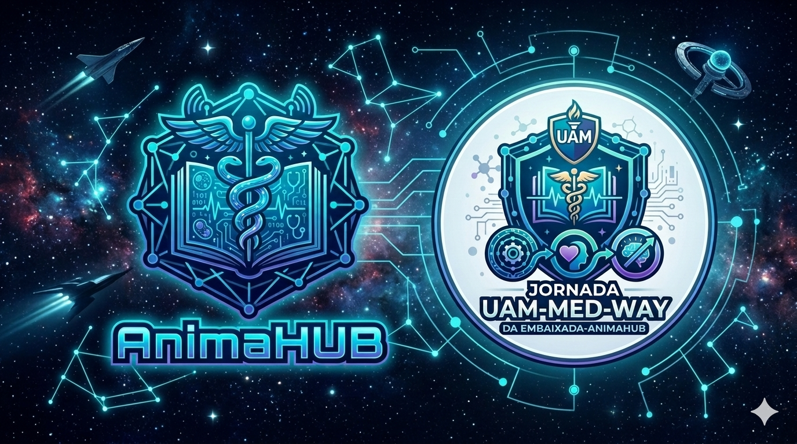
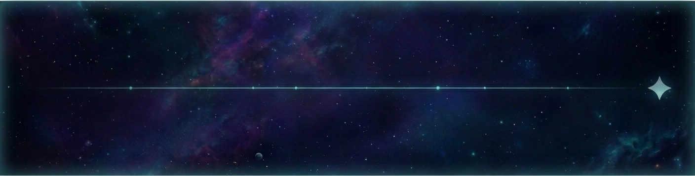
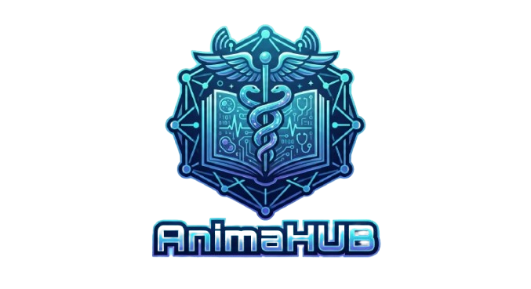

## Overview:
UAM-MED-WAY é uma coletânea de portfolios em formato de pdf com conhecimento integrativo

## Author:
Érik Luís Mendonça Botechia de Jesus Leite 
Instituição e Curso: Universidade Anhembi Morumbi (UAM) - Medicina 
E-Mail Acadêmico: <a href="mailto:12526118413@ulife.com.br">12526118413@ulife.com.br</a> 
E-Mail Preferencial: <a href="mailto:elbotechia@gmail.com">elbotechia@gmail.com</a> 
Instagram: <a href="https://instagram/ELBotechia">@ELBotechia</a> 
GitHub: <a href="https://github.com/elbotechia">@ELBotechia</a>

  
  

        
        
    

  </table>
 

